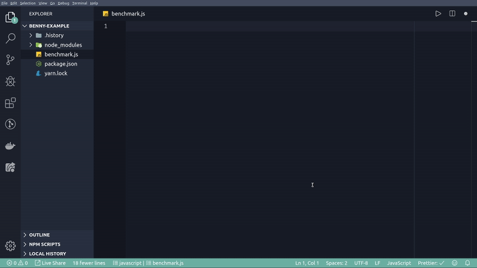

# Benny - a dead simple benchmarking framework




## Table of contents

1. [Overview](#overview)
2. [Installation](#installation)
3. [Quick example](#quick-example)
4. [API](#api)
5. [Working with many suites](#many-suites)
6. [Tweaking benchmarks](#tweaking)
7. [License](#license)

<a id='overview'></a>

## Overview

Benny is a wrapper for an excellent (but complex) [benchmark](https://www.npmjs.com/package/benchmark) package.

It provides an improved API that allows you to:

- prepare local setup for each case
- skip or run only selected cases
- save essential results to a file in a JSON format
- pretty-print results without additional setup
- use suite results as Promises

Additionally, it provides sound defaults suitable for most use cases and excellent IDE support with built-in type definitions.

<a id='installation'></a>

## Installation

Using NPM:

```sh
npm i benny -D
```

Using Yarn:

```
yarn add benny -D
```

<a id='quick-example'></a>

## Quick example

```js
/* benchmark.js */
const b = require('benny').default

b.suite(
  'Example',

  b.add('Reduce two elements', () => {
    ;[1, 2].reduce((a, b) => a + b)
  }),

  b.add('Reduce five elements', () => {
    ;[1, 2, 3, 4, 5].reduce((a, b) => a + b)
  }),

  b.cycle(),
  b.complete(),
  b.save({ file: 'reduce', version: '1.0.0' }),
)
```

Execute:

```sh
node benchmark.js
```

Output:

```
Running "Example" suite...
  Reduce two elements:
    156 340 552 ops/s, ±0.24%
  Reduce five elements:
    125 796 511 ops/s, ±0.59%
Finished 2 cases, fastest: Reduce two elements
Saved to: benchmark/results/reduce.json
```

File content:

```json
{
  "name": "Example",
  "date": "2019-09-28T01:39:05.804Z",
  "version": "1.0.0",
  "results": [
    {
      "name": "Reduce two elements",
      "ops": 156340552,
      "deviation": 0.24
    },
    {
      "name": "Reduce five elements",
      "ops": 125796511,
      "deviation": 0.59
    }
  ],
  "fastest": {
    "name": "Reduce two elements",
    "index": 0
  }
}
```

<a id='api'></a>

## API

```js
/* benchmark.js */
const { add, complete, cycle, save, suite } = require('benny')
// Or use other import methods:
// const benny = require('benny').default
// import { add, complete, cycle, save, suite } from 'benny'
// import benny from 'benny'

suite(
  // Name of the suite - required
  "My suite",

  // If the code that you want to benchmark has no setup,
  // you can run it directly:
  add('My first case', () => {
    myFunction()
  }),

  // If the code that you want to benchmark requires setup,
  // you should return it wrapped in function:
  add('My second case', () => {
    // Example setup:
    const testArr = Array.from({ length: 1000 }, (_, index) => index)

    // Benchmarked code wrapped in function:
    return () => myOtherFunction(testArr)
  }),

  // This benchmark will be skipped:
  add.skip('My third case', () => {
    1 + 1
  }),

  // This benchmark will be the only one that runs
  // (unless there are other cases marked by .only)
  add.only('My fourth case', () => {
    Math.max(1, 2, 3, 4, 5)
  }),

  // This will run when each case is benchmarked.
  // You can pass a function that takes an Event with the current results.
  // By default, it pretty-prints case summary
  cycle(),

  // This will run when all cases are benchmarked.
  // You can pass a function that takes an Event with all results.
  // By default, it prints a simple summary.
  complete(),

  // This will save essential results to a file.
  // You can pass an options object.
  // By default saves to benchmark/results/<ISO-DATE-TIME>.json
  save({
    // String or function that produces a string,
    // if function, then results Event will be passed as argument:
    file: 'myFileNameWithoutExtension'
    // Destination folder (can be nested), will be created if not exists:
    folder: 'myFolder',
    // Version string - if provided will be included in the file content
    version: require('package.json').version,
  }),
)
```

Of course, all methods are optional - use the ones you need.

Additionally, each suite returns a `Promise` that resolves with result event (the same as passed to `complete` method).

<a id="many-suites"></a>

## Working with many suites

You can create as many suites as you want. It is a good practice to define each suite in a separate file, so you can run them independently if you need. To run multiple suites create a main file when you import all your suites.

Example:

```js
/* suites/suite-one.js */

const b = require('benny').default

module.exports = b.suite(
  'Suite one',

  b.add('Reduce two elements', () => {
    ;[1, 2].reduce((a, b) => a + b)
  }),

  b.add('Reduce five elements', () => {
    ;[1, 2, 3, 4, 5].reduce((a, b) => a + b)
  }),

  b.cycle(),
  b.complete(),
  b.save({ file: 'reduce' }),
)
```

```js
/* suites/suite-two.js */

const b = require('benny').default

module.exports = b.suite(
  'Suite two',

  b.add('Multiple two numbers', () => {
    2 * 2
  }),

  b.add('Multiply three numbers', () => {
    2 * 2 * 2
  }),

  b.cycle(),
  b.complete(),
  b.save({ file: 'add' }),
)
```

```js
/* benchmark.js */

require('./suites/suite-one')
require('./suites/suite-two')
```

Run:

```
node benchmark.js
```

<a id="tweaking"></a>

## Tweaking benchmarks

If the default results are not optimal (high deviation etc.), you can change parameters for each case by providing an options object as a third parameter to `add` function.

Available options:

```typescript
/**
 * The delay between test cycles (secs).
 *
 * @default 0.005
 */
delay?: number

/**
 * The default number of times to execute a test on a benchmark's first cycle.
 *
 * @default 1
 */
initCount?: number

/**
 * The maximum time a benchmark is allowed to run before finishing (secs).
 *
 * Note: Cycle delays aren't counted toward the maximum time.
 *
 * @default 5
 */
maxTime?: number

/**
 * The minimum sample size required to perform statistical analysis.
 *
 * @default 5
 */
minSamples?: number

/**
 * The time needed to reduce the percent uncertainty of measurement to 1% (secs).
 *
 * @default 0
 */
minTime?: number
```

Example usage:

```js
const b = require('benny').default

const options = {
  minSamples: 10,
  maxTime: 2,
}

b.suite(
  'My suite',

  b.add(
    'Reduce two elements',
    () => {
      ;[1, 2].reduce((a, b) => a + b)
    },
    options,
  ),
  // ...other methods
)
```

<a id="license"></a>

## License

Project is under open, non-restrictive [ISC license](LICENSE).
